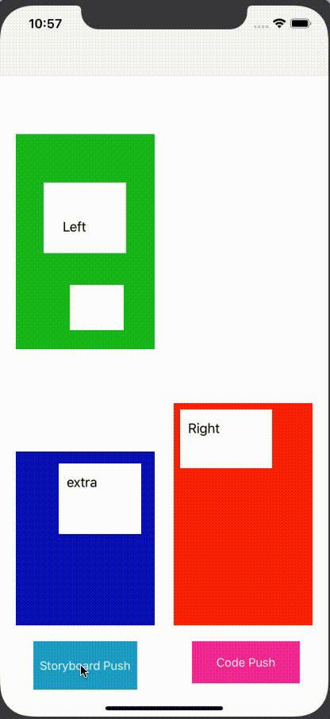
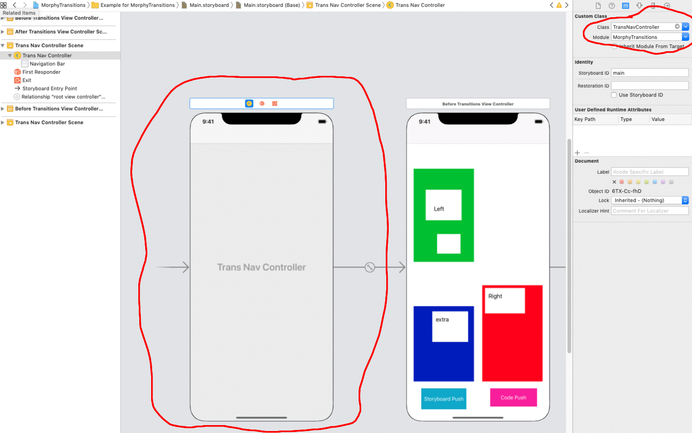
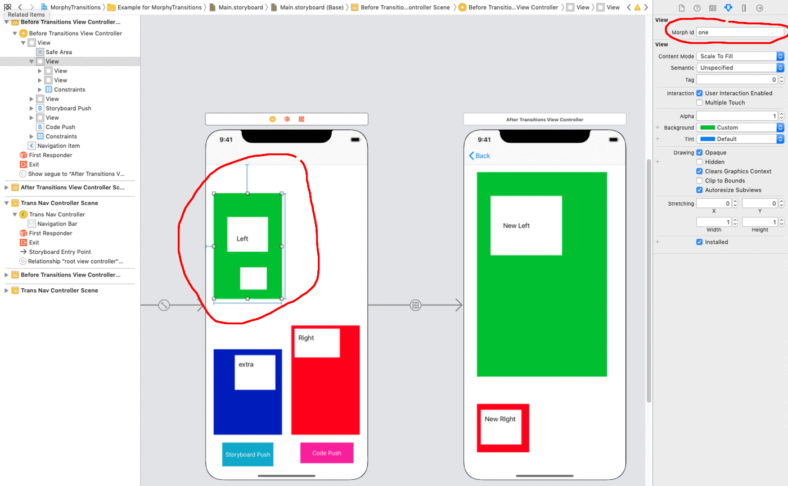
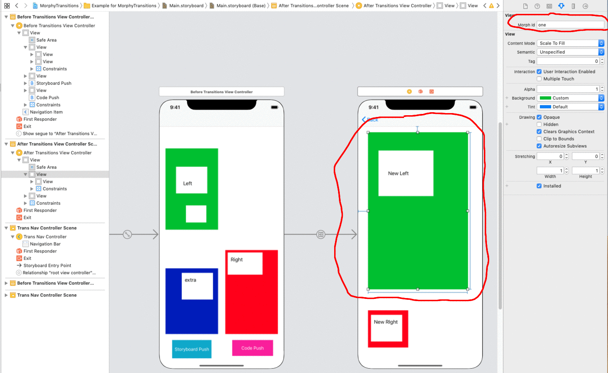

# MorphyTransitions

[](https://travis-ci.org/awaran/MorphyTransitions)
[](https://cocoapods.org/pods/MorphyTransitions)
[](https://cocoapods.org/pods/MorphyTransitions)
[](https://cocoapods.org/pods/MorphyTransitions)

## Transition example (in slow motion)



## Video tutorial


## Instructions (for Storyboard scroll down for instructions in code)
After installing the cocoapod (details down below)

#### Step 1:
Replace UINavigationController with TransNavController


#### Step 2:
Each view will now have a Morph id section in your storyboard.  Create IDs that coraspond to views that morph into / out of each other.  For example, if I wanted the green upper left view from the starting view controller to morph into the upper left green view of the ending view controller, I would name both views with the same  Morph Id.  In this case, I named them one but you can pick any identifier you want to.


Step 3:
Your done!


## Instructions (for Code)
Step 1:
Replace UINavigationController with TransNavController

Step 2:
Each view will now have var name morphIdentifier.  Create morphIdentifiers that coraspond to views that morph into / out of each other.  For example, if I wanted the green upper left view from the starting view controller to morph into the upper left green view of the ending view controller, I would name both views with the same  morphIdentifiers.  In this case, I named them one but you can pick any identifier you want to.

```swift
beforeVC.one.morphIdentifier = "one"
afterVC.one.morphIdentifier = "one"
```


## Example

To run the example project, clone the repo, and run `pod install` from the Example directory first.

## Installation

MorphyTransitions is available through [CocoaPods](https://cocoapods.org). To install
it, simply add the following line to your Podfile:

```ruby
pod 'MorphyTransitions'
```

## Author

Arjay Waran, waran.arjay@gmail.com

## License

MorphyTransitions is available under the MIT license. See the LICENSE file for more info.
